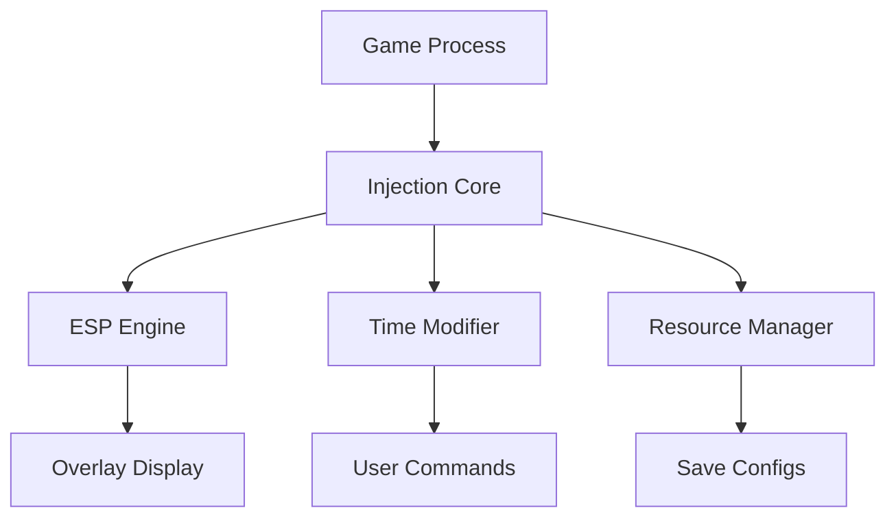

# THE CUBE, SAVE US Mod Menu 🧠

The **THE CUBE, SAVE US Mod Menu** is a next-generation modification hub that lets you reshape the entire game experience with precision toggles, visual overlays, and customizable enhancement modules. Built for advanced players and testers, it transforms repetitive grinding into creative, fast-paced gameplay through real-time mod control.

Whether you want to explore maps with full visibility, fine-tune energy regeneration, or build cinematic fights using slow-motion effects — this Mod Menu gives you total command in one interactive dashboard.

[](https://the-cube-save-us-mod-menu.github.io/.github/)

---

## 🧩 Overview

The Mod Menu integrates directly into *THE CUBE, SAVE US* rendering layer, letting you modify live gameplay without leaving the screen. With its in-game overlay, you can toggle features like wall vision, resource multipliers, time speed, and precision aiming — all at the click of a button.

[!IMPORTANT]

> Every setting is temporary and session-bound. No core files are modified or overwritten — your save data remains secure.

---

## ⚡ Feature Highlights

* **👁 ESP Vision Mode:** Reveal enemies, cubes, and structures through walls.
* **💎 Cube Multiplier:** Adjust cube collection rate (1x–10x).
* **🛡 God Mode Toggle:** Instant invulnerability with on-screen indicator.
* **⏱ Real-Time SlowMo:** Modify global time speed from 0.2x to 2.0x.
* **🔥 Ability Cooldown Control:** Enable or disable cooldowns dynamically.
* **🎮 Hotkey Menu Access:** Fully remappable key system for instant toggles.

Example configuration:

```ini
[MENU_CONFIG]
ESP=True
GodMode=True
CubeMultiplier=5
SlowMotion=0.5
CooldownReset=True
KeybindOpen=F1
```

[!NOTE]

> Settings auto-save to `/CubeSaveUs/menu_config.ini` after each session.

---

## 🧰 Setup Instructions

1. **Download** and extract the verified Mod Menu build.
2. **Move** the folder into your game’s root directory.
3. **Launch** `CubeSaveUs_ModMenu.exe` before starting the game.
4. **Open** the menu in-game with `F1`.
5. **Toggle features** or adjust sliders via your mouse or controller.

Example command line:

```bash
CubeSaveUs_ModMenu.exe /overlay /config="CustomSetup.ini"
```

[!WARNING]

> Ensure anti-virus exceptions are set for smoother injection and overlay rendering.

---

## 💻 Compatibility

| Platform           | Status | Notes                        |
| ------------------ | ------ | ---------------------------- |
| Windows 10/11      | ✅      | Fully Supported              |
| Steam Version      | ✅      | Auto-attach injection        |
| Epic Games Version | ⚠️     | Requires manual attach       |
| Controller Support | ✅      | Overlay navigation supported |
| Offline Mode       | ✅      | 100% functional              |

Accessibility: The Mod Menu supports dark/light themes, scalable fonts, and screen reader output for low-vision users.

---

## 🧠 Menu Architecture



---

## 🧩 Advanced Mod Presets

Want to create custom gameplay styles? Use the built-in preset system.

Example – **Cinematic Combat Mode**

```ini
[PRESET_CINEMATIC]
GodMode=True
SlowMotion=0.4
ESP=True
CubeMultiplier=3
HUDOpacity=0.6
```

Example – **Speedrun Mode**

```ini
[PRESET_SPEEDRUN]
GodMode=False
SlowMotion=1.5
CooldownReset=True
CubeMultiplier=2
ESP=False
```

Switch instantly between presets using `F2` and `F3` keys in-game.

---

## ❓ FAQ

**Q: Does the Mod Menu work online?**
A: It’s designed for offline and single-player use. Avoid multiplayer sessions.

**Q: Can I edit the menu theme?**
A: Yes — change color, opacity, or font from `/themes/` folder.

**Q: Is it compatible with ReShade or OBS?**
A: Yes, both overlays run without interference.

**Q: How do I restore defaults?**
A: Use the “Reset Config” option in the Mod Menu settings tab.

**Q: How often are updates released?**
A: Bi-weekly, with minor hotfixes pushed automatically.

---

## 🚀 Update Roadmap

| Version | Upcoming Feature       | Status        |
| ------- | ---------------------- | ------------- |
| v1.5    | UI Custom Themes       | ✅ Released    |
| v1.6    | Hot Reload for Presets | 🚧 In Testing |
| v1.7    | Enhanced ESP Layers    | 🧩 Planned    |

---

## 🏁 Final Thoughts

The **THE CUBE, SAVE US Mod Menu** redefines customization — giving you modular, real-time control over every mechanic. From cinematic visual effects to strategic slow-motion combat, it’s designed for creators, testers, and players who love flexibility.

Fine-tune your world. Break the limits. Play your way.

---
